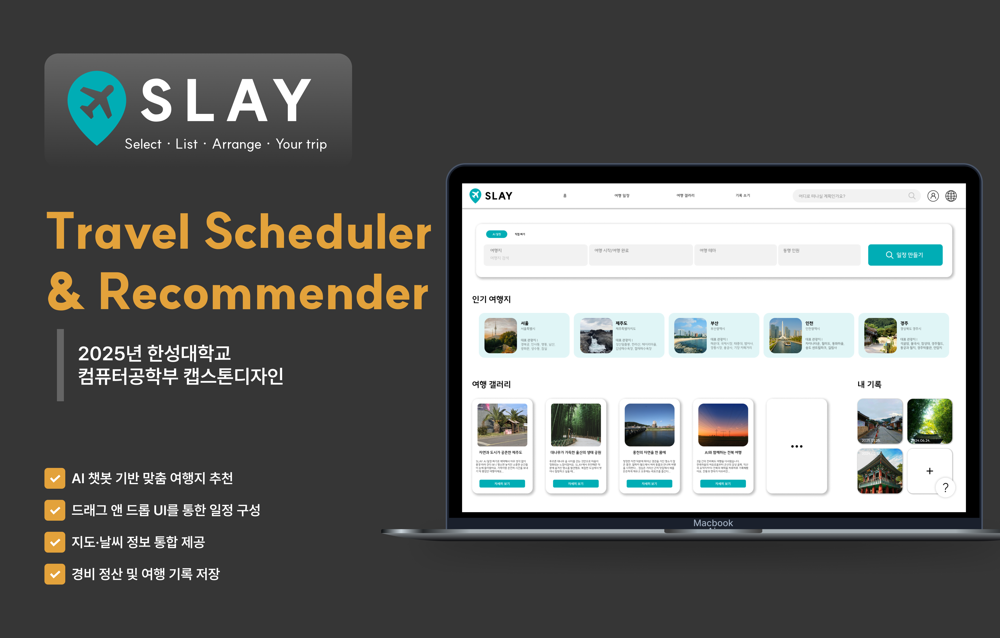
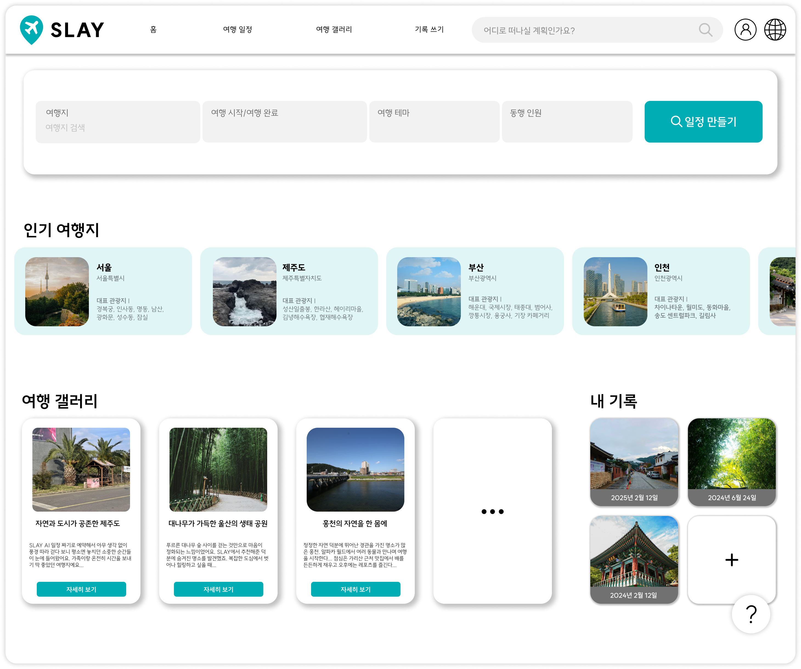
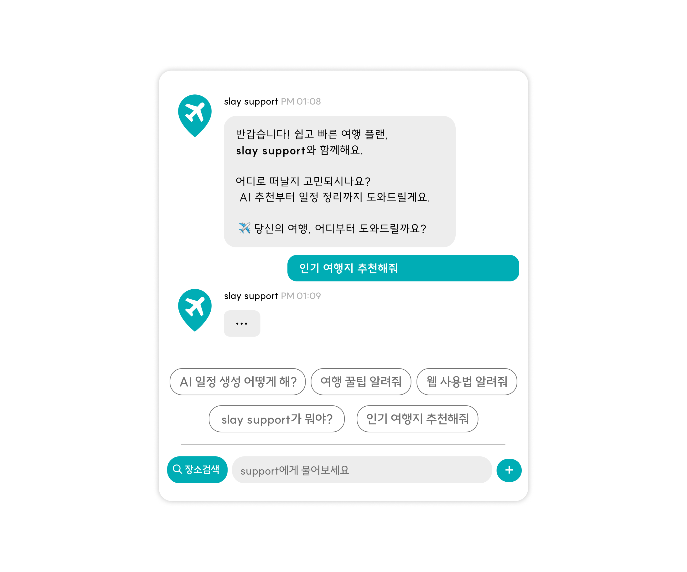
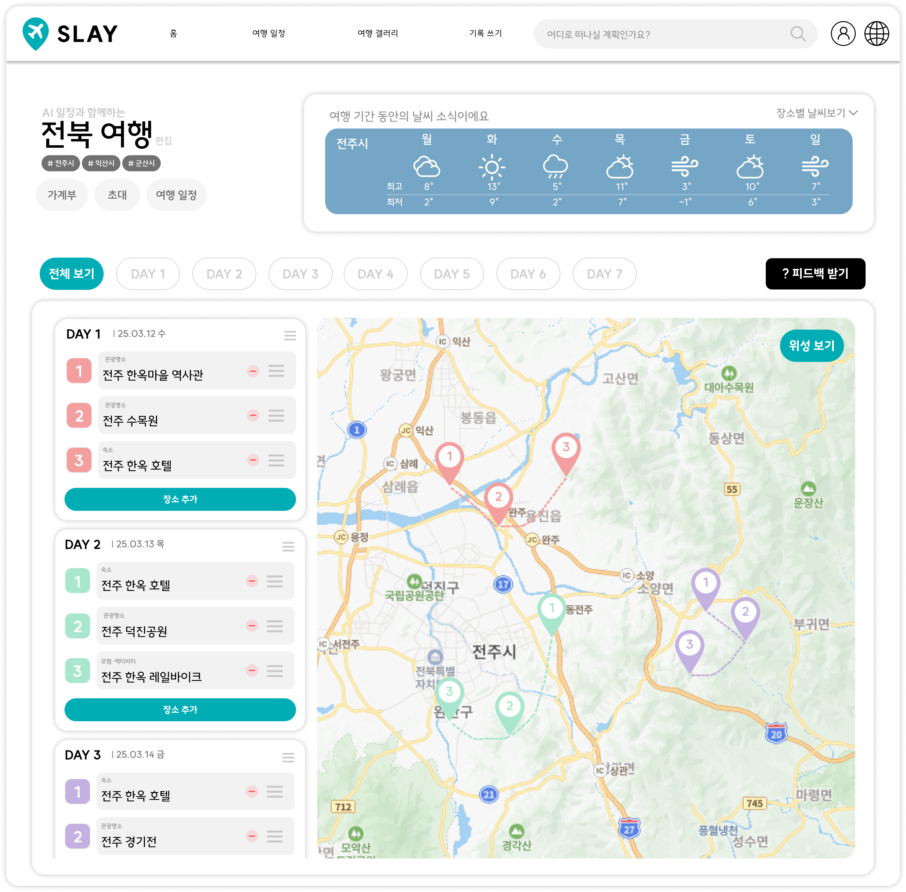
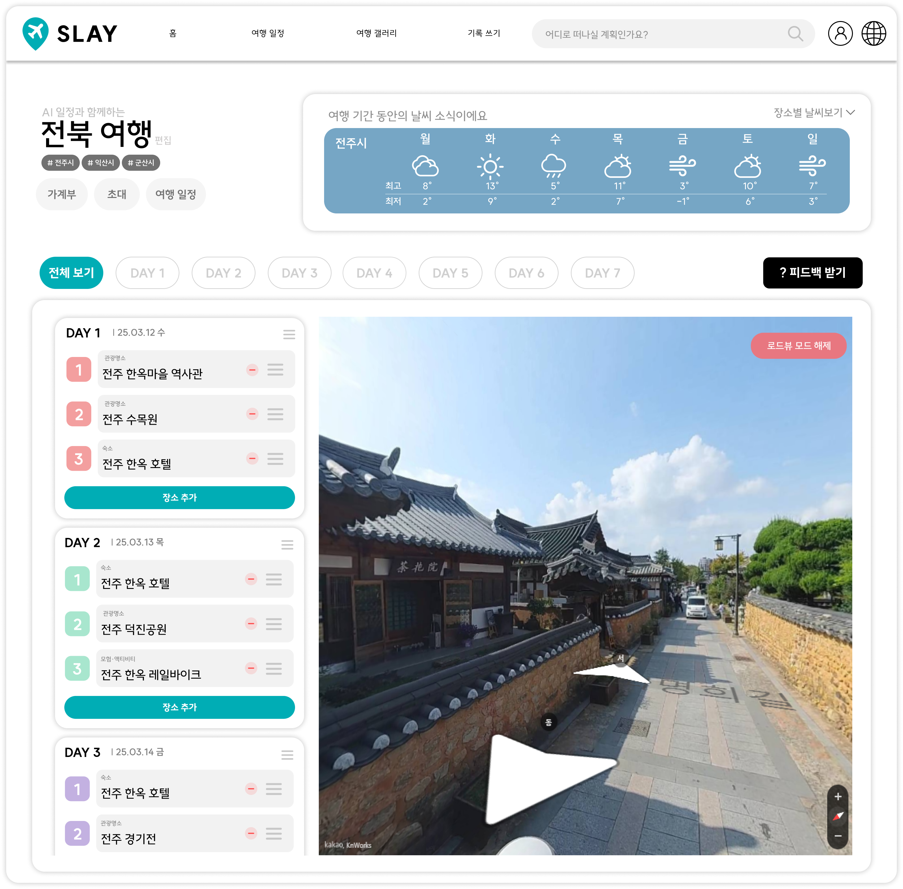
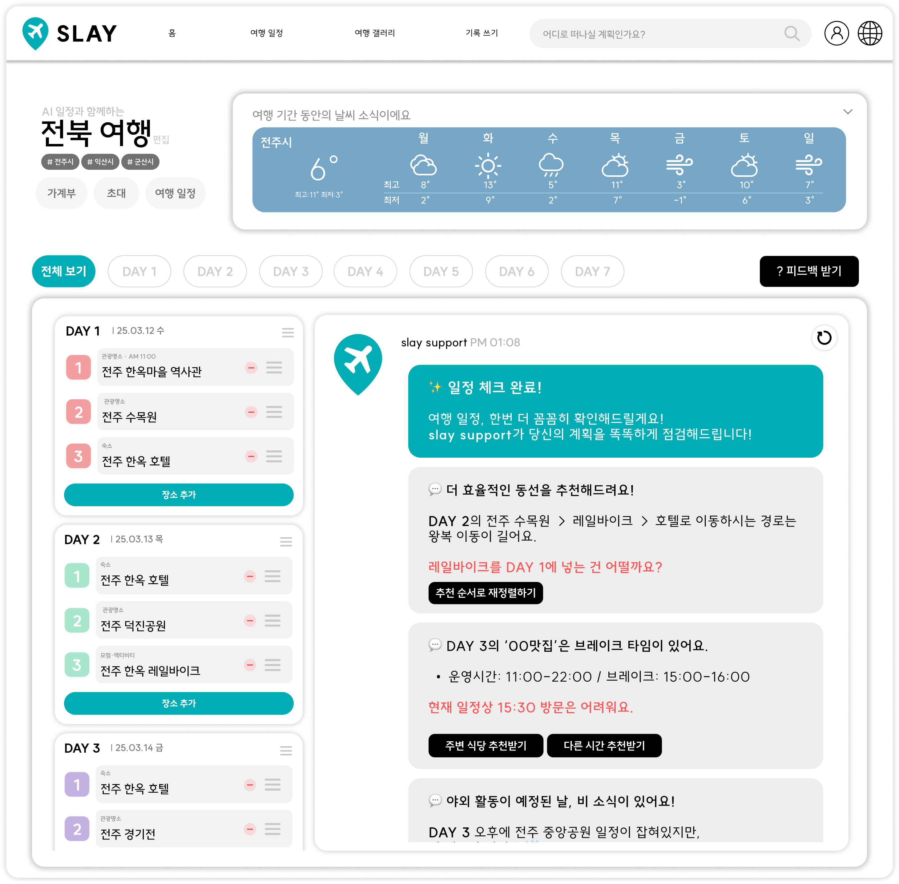
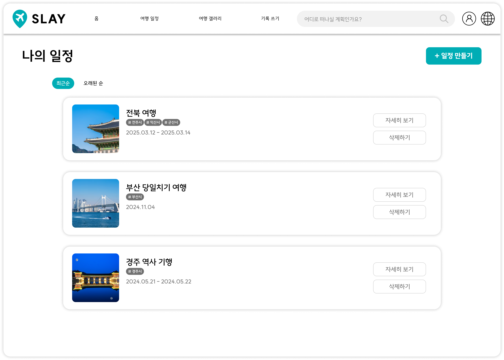
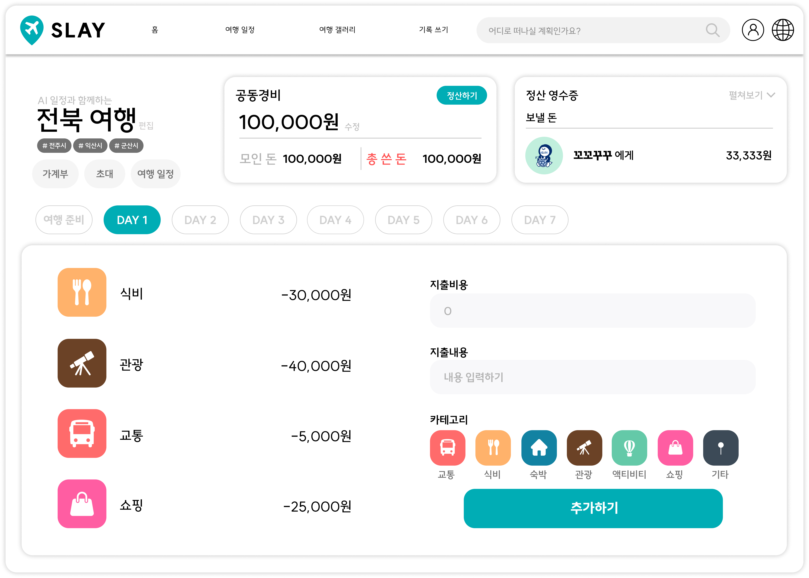
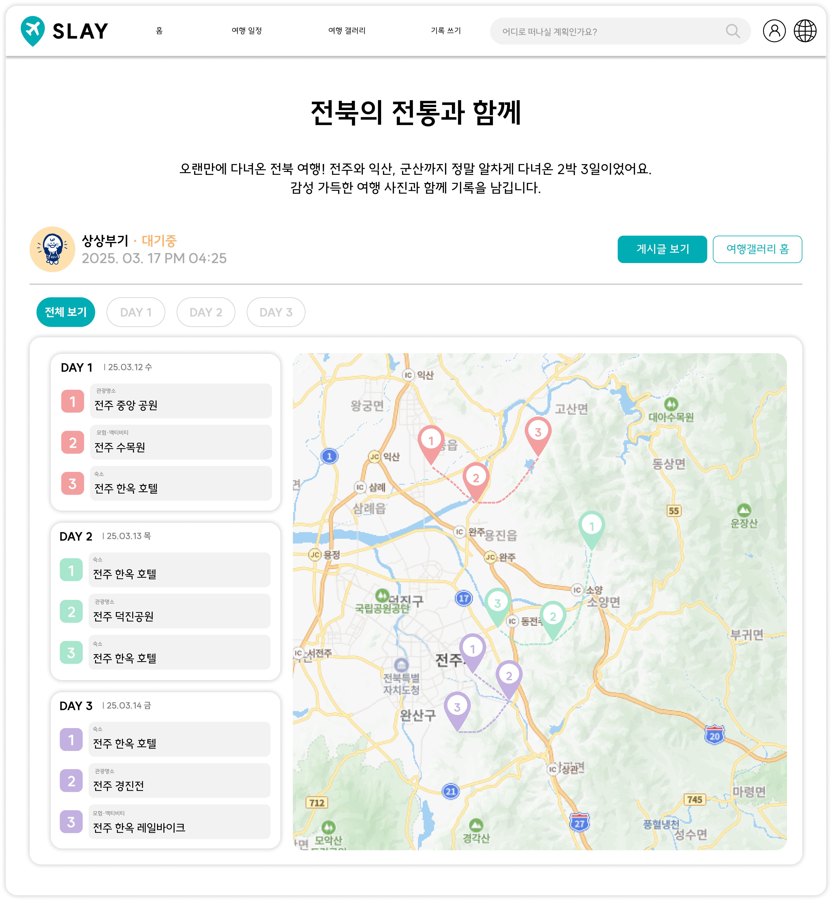

# 🧭 Travel Scheduler & Recommender

### ⚔️ Team SLAY

> 맞춤형 여행 일정 추천 / 사용자 일정 관리 · 공유 플랫폼



## 📌 프로젝트 개요

> **여행 준비, SLAY와 함께면 충분해요.** 

AI 여행지 추천부터 일정 · 지출 관리까지,  
복잡한 과정을 간단하게 만들어주는 여행 전용 웹 플랫폼 **SLAY**

---

## 📋 주요 기능 한눈에 보기

> 복잡한 앱 전전은 그만,  
> **더 간편하게, 더 똑똑하게, 더 즐겁게**  
> **SLAY**와 함께 가뿐한 여행을 시작하세요.

### ✔️ 핵심 기능

| 기능                  | 설명                |
| ------------------- | ----------------- |
| 🧠 **AI 추천**        | 여행 성향 기반 장소 자동 추천 |
| 📆 **일정 구성**        | 드래그 앤 드롭으로 간편 편집  |
| 🗺️ **지도·날씨 통합**    | 위치·기상 정보 한눈에 확인   |
| 👁️ **Street View** | 방문 전 장소 미리보기 지원   |
| 💸 **지출 관리**        | 항목별 지출 입력 및 정산    |
| 📝 **기록 저장**        | 여행 일정 및 후기 저장 공유  |

---

## 🖼️ 주요 화면

| 🏠 메인 홈 화면 | 💬 AI 챗봇 추천 |
|------------------|------------------|
|  |  |

| 📆 일정 생성 및 편집 | 👁️ 장소 미리보기 (Street View) |
|----------------------|-------------------------------|
|  |  |

| 🤖 AI 피드백 기능 | 📋 나의 전체 일정 보기 |
|------------------|-------------------------|
|  |  |

| 💰 지출 입력 및 정산 | 🖼️ 여행 기록 모아보기 (갤러리) |
|----------------------|-------------------------------|
|  |  |

| 📖 여행 기록 - 게시글 | ✏️ 여행 기록 - 일정 보기 |
|--------------------|---------------------------|
|  |  |

---

## 🎥 시연 영상

> 아래 링크를 통해 SLAY의 실제 사용 과정을 확인할 수 있습니다.

🔗 [시연 영상 보러 가기](https://youtu.be/링크)

---

## 🛠️ 기술 스택

| 구분 | 기술 스택 |
|------|-----------|
| 💻 **Frontend** |  |
| ⚙️ **Backend** |   |
| 🗄️ **Database** |   |
| 🌐 **API & 연동** |      |
| 🔐 **Authentication** |   |
| 🚀 **Deployment** |   |
| 🤝 **Collaboration** |      |

---

## 📦 프로젝트 실행 방법

> SLAY 프로젝트를 직접 실행해보고 싶다면 아래 절차에 따라 실행해보세요.

### 🧑‍💻 환경 준비

- Node.js 18+  
- npm 9+  
- PostgreSQL 설치 및 연결 설정

### 🚀 실행 절차

```bash
# 1. 레포지토리 클론
git clone https://github.com/TeamSLAY/SLAY.git

# 2. 프로젝트 디렉토리로 이동
cd SLAY

# 3. 필요한 패키지 설치
npm install

# 4. .env 파일 설정 (예시 참고하여 환경변수 입력)

# 5. 개발 서버 실행
npm start
```

---

## 👥 팀 소개

<table>
  <tr>
    <td align="center">
      <br>
      <b>👑 오현석</b><br>
      <sub>Backend Developer</sub><br>
      <a href="https://github.com/reallies">GitHub</a><br>
      <code>0323eric@naver.com</code>
    </td>
    <td align="center">
      <br>
      <b>강연수</b><br>
      <sub>UX / UI / Frontend</sub><br>
      <a href="https://github.com/mamemomif">GitHub</a><br>
      <code>yskang009@gmail.com</code>
    </td>
    <td align="center">
      <br>
      <b>구정현</b><br>
      <sub>Backend / DB</sub><br>
      <a href="https://github.com/hyeonn9">GitHub</a><br>
      <code>1319ono@gmail.com</code>
    </td>
    <td align="center">
      <br>
      <b>김기환</b><br>
      <sub>API / Deployment</sub><br>
      <a href="https://github.com/gihwan1112">GitHub</a><br>
      <code>gihwan494@gmail.com</code>
    </td>
  </tr>
</table>

---

> 👏 **"여행을 준비하는 모든 순간, SLAY가 함께합니다."**