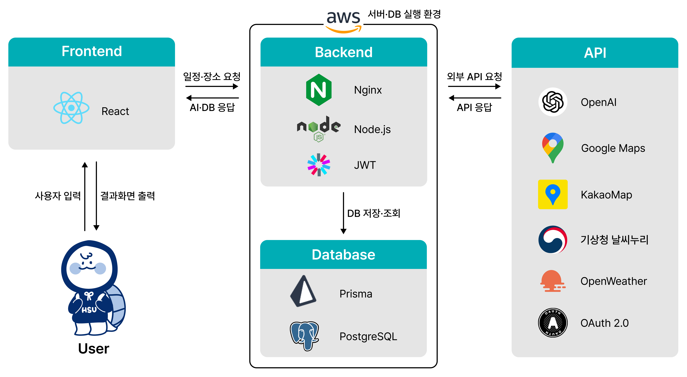

# 🧭 Travel Scheduler & Recommender

### ⚔️ Team SLAY

<<<<<<< HEAD
> AI 기반 맞춤형 여행 일정 추천 및 관리 · 공유 플랫폼


## 📌 프로젝트 개요

> **여행 준비, SLAY와 함께면 충분해요.** 

AI 여행지 추천부터 일정 · 지출 관리까지,  
=======
> 맞춤형 여행 일정 추천 / 사용자 일정 관리 · 공유 플랫폼


---

<<<<<<< HEAD
## Design
- **UI/UX 디자인:**  
  - Figma 디자인 참고: [Figma Design](https://www.figma.com/design/43bODe77hYu02GHCPcvaD1/2025-1-%EC%BA%A1%EC%8A%A4%ED%86%A4-%EB%94%94%EC%9E%90%EC%9D%B8?node-id=0-1&t=JjS8VRgIPhXlqtoS-1)

## Npm(Node Package Module) Command
- **/backend : node server.js**  
  - express(node) 서버 가동
- **/root : npm start(nodemon)**  
  - React Webpack 서버(localhost:3000)와 express 서버(localhost:8080) 동시 가동, proxy를 통해 백엔드 api 연동 설정 완료
- **/root : npm run dev**  
  - React에서 정적 파일 서빙 후, express 서버에 연동, 배포 시 사용 커맨드

## Npm(Node Package Module) Command
- **개발환경**  
  - React => npm start를 통해 프론트엔드 환경에서 개발, proxy를 통해 백엔드 api 연동
- **배포환경**  
  - root => npm run dev를 통해 React 정적파일 serving 후 배포


**자세한 사항은 루트 디렉터리 아래에 package.json을 참고**  

  

=======
## 📌 프로젝트 개요

> **여행 준비, SLAY와 함께면 충분해요.** 

AI 여행지 추천부터 일정 · 지출 관리까지!  
>>>>>>> develop/mergedFeedback3
복잡한 과정을 간단하게 만들어주는 여행 전용 웹 플랫폼 **SLAY**

---

<<<<<<< HEAD
## 🪄 주요 기능 한눈에 보기
=======
## 📋 주요 기능 한눈에 보기
>>>>>>> develop/mergedFeedback3

> 복잡한 앱 전전은 그만,  
> **더 간편하게, 더 똑똑하게, 더 즐겁게**  
> **SLAY**와 함께 가뿐한 여행을 시작하세요.

### ✔️ 핵심 기능

<<<<<<< HEAD
| 기능                  | 설명                |
| ------------------- | ----------------- |
| 🧠 **AI 추천**        | 여행 성향 기반 장소 자동 추천 |
| 📆 **일정 구성**        | 드래그 앤 드롭으로 간편 편집  |
| 🗺️ **지도·날씨 통합**    | 위치·기상 정보 한눈에 확인   |
| 👁️ **Street View** | 방문 전 장소 미리보기 지원   |
| 💸 **지출 관리**        | 항목별 지출 입력 및 정산    |
| 📝 **기록 저장**        | 여행 일정 및 후기 저장 공유  |

---

## 🖼️ 주요 화면

| 🏠 홈 화면 | 💬 AI 챗봇 |
|------------------|------------------|
|  |  |

| 📆 일정 생성 및 편집 | 🔍 장소 미리보기 |
|----------------------|-------------------------------|
|  |  |

| 🤖 AI 피드백 | 📋 나의 전체 일정 보기 |
|------------------|-------------------------|
|  |  |

| 💰 지출 입력 및 정산 | 🏛️ 여행 기록 모아보기 |
|----------------------|-------------------------------|
|  |  |

| 📖 여행 기록 - 게시글 | ✏️ 여행 기록 - 일정 보기 |
|--------------------|---------------------------|
|  |  |

---

## 🎥 시연 영상

> 아래 링크를 통해 SLAY의 실제 사용 과정을 확인할 수 있습니다.

🔗 [시연 영상 보러 가기](https://youtu.be/링크)

---

## 🛠️ 기술 스택

| 구분 | 기술 스택 |
|------|-----------|
| 💻 **Frontend** |  |
| ⚙️ **Backend** |   |
| 🗄️ **Database** |   |
| 🌐 **API & 연동** |      |
| 🔐 **Authentication** |   |
| ⚡ **Deployment** |   |
| 🤝 **Collaboration** |      |

---

## 🧱 프로젝트 구조

> SLAY의 전체 시스템 구조와 주요 구성 요소는 아래와 같습니다.



---

## 📦 프로젝트 실행 방법

> SLAY 프로젝트를 로컬에서 실행해보고 싶다면 아래 절차에 따라 진행하세요.

### 🧑‍💻 실행 환경

- 개발 툴: **VSCode**
- Node.js 18+  
- npm 9+  
- PostgreSQL (Supabase 사용 시 자동 연결)  
- 프론트엔드: `localhost:3000`  
- 백엔드: `localhost:8080`

### 🗂️ 디렉토리 구조

```bash
/SLAY
├── backend
│ ├── .env
│ ├── ...
├── frontend
│ ├── .env
│ ├── ...
├── package.json
```

### 🔐 환경 변수 설정
#### 📁 `/backend/.env`
```c
//데이터베이스
DATABASE_URL="supabase에서 생성"
DIRECT_URL="supabase에서 생성"

//JWT & 세션
SESSION_SECRET=your-api-key
JWT_SECRET=your-api-key
JWT_REFRESH_SECRET=your-api-key

//구글 로그인
GOOGLE_CLIENT_ID=your-api-key
GOOGLE_CLIENT_SECRET=your-api-key

//네이버 로그인
NAVER_CLIENT_ID=your-api-key
NAVER_CLIENT_SECRET=your-api-key

//카카오 로그인
KAKAO_CLIENT_ID=your-api-key
//openai
OPENAI_API_KEY=your-api-key

//날씨
WEATHER_API_KEY=your-api-key

//기상청 날씨
WEATHER_API_KEY2=your-api-key

//구글맵
GOOGLE_MAPS_API_KEY=your-api-key
```

#### 📁 `/frontend/.env`
```c
//카카오맵 REST API KEY
REACT_APP_KAKAO_REST_API_KEY=your-api-key

//카카오맵 JAVASCRIPT KEY
REACT_APP_KAKAO_JAVASCRIPT_KEY=your-api-key

//날씨 API
REACT_APP_WEATHER_API_KEY=your-api-key
```

### 🚀 실행 절차

#### 1. 레포지토리 클론
```bash
git clone https://github.com/TeamSLAY/SLAY.git
cd SLAY
```

#### 2. 백엔드 실행
```bash
cd backend

# 패키지 설치
npm install

# Prisma 설정
npx prisma generate

# 서버 실행
npm start
```

#### 3. 프론트엔드 실행
```bash
cd frontend
npm install
```

#### 4. 개발 서버 실행
```bash
# 루트 디렉토리에서
cd ..
npm install # 또는 npm i
npm run build
npm run dev  # 또는 npm start
```

### 💡 참고 사항
- 백엔드: localhost:8080, 프론트엔드: localhost:3000에서 실행됩니다.
- .env 파일은 /backend, /frontend 디렉토리에 각각 생성해야 합니다.
- Supabase를 사용하는 경우 DATABASE_URL과 DIRECT_URL은 Supabase 콘솔에서 복사해 입력합니다.
=======
- 🧠 **AI 맞춤 추천**, 내 여행 성향에 꼭 맞는 장소 자동 추천
- 📆 **드래그 앤 드롭 일정 관리**, UI로 직관적인 여행 설계
- 🗺️ **지도 + 날씨 통합 제공**, 여행지 상황까지 한눈에
- 💸 **지출 관리와 후기 작성**, 여행의 기록을 더 가치 있게
- 🤝 **실시간 공동 편집**, 동행자와 함께 만드는 일정

---

## 🛠 기술 스택


### 🖥️ Front-End

- 
- 

### ⚙️ Back-End

- 
- 

### 🗄️ Database

- 
- 

### 🌐 API & Integration

- 
- 
- 
- 

### 🔐 Authentication

- 
- 

### 🚀 Deployment

- 
- 

### 🧩 Collaboration Tool

- 
- 
- 
- 

---

## 🎨 디자인

- [📎 Figma Design 바로가기](https://www.figma.com/design/43bODe77hYu02GHCPcvaD1/2025-1-%EC%BA%A1%EC%8A%A4%ED%86%A4-%EB%94%94%EC%9E%90%EC%9D%B8?node-id=0-1&t=JjS8VRgIPhXlqtoS-1)
>>>>>>> develop/mergedFeedback3

---

## 👥 팀 소개

<<<<<<< HEAD
<table>
  <tr>
    <td align="center">
      <br>
      <b>👑 오현석</b><br>
      <sub>Backend Developer</sub><br>
      <a href="https://github.com/reallies">GitHub</a><br>
      <code>0323eric@naver.com</code>
    </td>
    <td align="center">
      <br>
      <b>강연수</b><br>
      <sub>UX / UI / Frontend</sub><br>
      <a href="https://github.com/mamemomif">GitHub</a><br>
      <code>yskang009@gmail.com</code>
    </td>
    <td align="center">
      <br>
      <b>구정현</b><br>
      <sub>Backend / DB</sub><br>
      <a href="https://github.com/hyeonn9">GitHub</a><br>
      <code>1319ono@gmail.com</code>
    </td>
    <td align="center">
      <br>
      <b>김기환</b><br>
      <sub>API / Deployment</sub><br>
      <a href="https://github.com/gihwan1112">GitHub</a><br>
      <code>gihwan494@gmail.com</code>
    </td>
  </tr>
</table>

---

> 👏 **"여행을 준비하는 모든 순간, SLAY가 함께합니다."**
=======
| Profile                                                      | Name    | Role                                         | Contact                                                      |
| ------------------------------------------------------------ | ------- | -------------------------------------------- | ------------------------------------------------------------ |
|  | 👑오현석 | Backend Developer                            | gitHub: [@reallies](https://github.com/reallies)<br>Email: 0323eric@naver.com |
|  | 강연수  | UX/UI · Frontend / Developer                 | gitHub: [@mamemomif](https://github.com/mamemomif)<br>Email: yskang009@gmail.com |
|  | 구정현  | Backend Developer / Database Manager         | gitHub: [@hyeonn9](https://github.com/hyeonn9)<br>Email: 1319ono@gmail.com |
|  | 김기환  | External API Integrator / Deployment Manager | gitHub: [@gihwan1112](https://github.com/gihwan1112)<br>Email: gihwan494@gmail.com |

---

> 👏 **"여행을 준비하는 모든 순간, SLAY가 함께합니다."**
>>>>>>> origin/develop/frontend
>>>>>>> develop/mergedFeedback3
